# Advanced Lane Finding - Introduction

In this project, the goal is to write a software pipeline to identify the lane boundaries in a video from a front-facing camera on a car. Traffic lanes are drawn on to on input video from the front camera of a self driving car using computer vision techniques. The image is also used to compute statistics about the curvature of the lane in which the car is currently driving, as well as how far the car is located from the center of the lane. Visual feedback in the form of color is used to show the driver how far the car is from the center of the lane. The filled area will be green if the car is located within a certain threshold of the enter of the lane. It will move from yellow to red as the car gets further and further away from the center. The result of the pipeline for an array of test images is shown below:

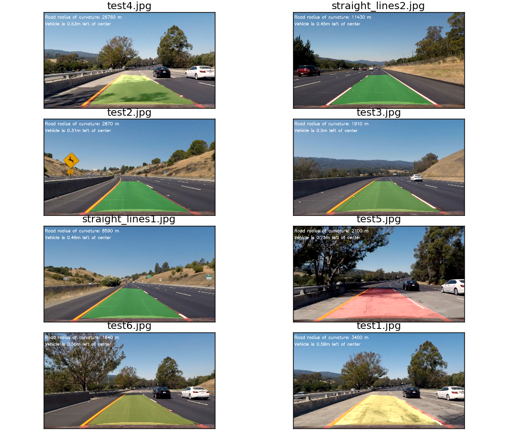


The steps taken to produce the result are as follows:

* Compute the camera calibration matrix and distortion coefficients given a set of chessboard images.
* Apply a distortion correction to raw images.
* Apply a perspective transform to rectify binary image ("birds-eye view").
* Use color transforms, gradients, etc., to create a thresholded binary image.
* Detect lane pixels and fit to find the lane boundary.
* Determine the curvature of the lane and vehicle position with respect to center.
* Warp the detected lane boundaries back onto the original image.
* Output visual display of the lane boundaries and numerical estimation of lane curvature and vehicle position.

The pipeline can be seen clearly in the `__image_pipeline(self, img)` method in the LaneFinder class:

```python
    def __image_pipeline(self, img):
        """The pipeline for processing images.
        """
        resized     = self.__resize_image(img)
        undistorted = self.__correct_distortion(resized)
        warped      = self.__warp_image_to_biv(undistorted)
        thresholded = self.__threshold_image(warped)
        lines       = self.__get_lane_lines(thresholded)
        result      = self.__draw_lane_lines(undistorted, thresholded, include_stats=True)
             
        return result
```

A discussion of each of this steps is what follows in this README. The final result for the project is shown in the following video:
<br>
<br>
<center>[Link to project video](https://youtu.be/1tymBEx04Q8)</center>
<br>
<br>
To use the class on different videos, the following code can be used

```python
from lane_finder import LaneFinder

obj = LaneFinder()
obj.run('video.mp4')
```

# Camera Calibration

Step one to obtaining an accurate result for positioning using cameras is to calibrate the camera. As all cameras with lenses introduce some form of distortion to the image, it is necessary to apply a transformation to the image to correct this distortion. The `cv2` library provide methods to do this calibration by using pictures of chess board patterns taken with the camera. 

I start by preparing "object points", which will be the (x, y, z) coordinates of the chessboard corners in the world. Here I am assuming the chessboard is fixed on the (x, y) plane at z=0, such that the object points are the same for each calibration image. Thus, `objp` is just a replicated array of coordinates, and `objpoints` will be appended with a copy of it every time I successfully detect all chessboard corners in a test image. `imgpoints` will be appended with the (x, y) pixel position of each of the corners in the image plane with each successful chessboard detection.

I then used the output `objpoints` and `imgpoints` to compute the camera calibration and distortion coefficients using the `cv2.calibrateCamera()` function. I applied this distortion correction to the test image using the `cv2.undistort()` function.

A convenient object to perform the whole task has been implemented in the `tools` module and can be used as follows.
```python

from tools import DistortionCorrector
import glob

distCorrector = DistortionCorrector('./camera_cal/')
cal_images_paths = glob.glob('./camera_cal/cal*.jpg')
cal_images = []

for fname in cal_images_paths:
    cal_images.append(mpimg.imread(fname))

# Fit the corrector to the images
distCorrector.fit(cal_images)

# Undistort image
undistort = distCorrector.undistort(new_image)
    
```

After performing the .fit method, the DistortionCorrector object will save a `calibration.p` pickle file containing the `mtx` and `dst` matricies needed to perform a undistortion, in the calibration folder passed to it during initialization. This helps speed up the process for the pipeline.

An exaggerated result from a fish eye lense camera is shown below:

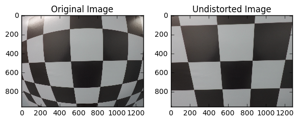

The results from the project camera are a touch more subtle:


# Perspective Transformation

A perspective transformation is then applied to the input image. Due to the front facing camera used in the car, the road lines (which are known to be parallel) appear to converge in the middle of the screen in an effect known as a [vanishing point.](https://en.wikipedia.org/wiki/Vanishing_point). In addition, parallel lines can appear to have different curvatures.

As we want to calculate the curvature of the road, a birds eye perspective is more suitable. In order to transform the image to a top down image, the `cv2` library is again used. First the `cv2.getPerspectiveTransform()` method is used to produce a transformation matrix `M` that can be used to transform an image to birds eye view. As eventually, the image must be transformed back, the same method can be used to produce a inverse matrix `M_inv`. The method takes in source and destination point, i.e the points on a image, that are desired to be mapped to destination point in a resulting image. The transformation can be applied using `cv2.warpPerspective()`. The resulting transformation is as follows:

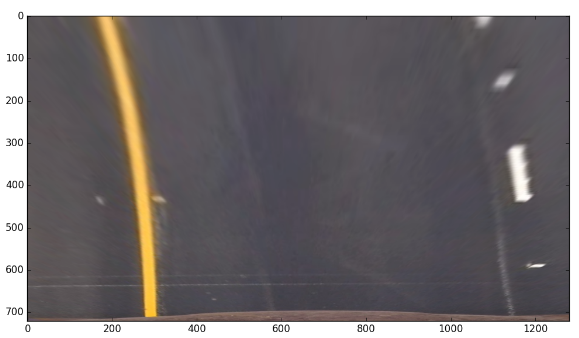

# Image thresholding

The next step in the pipeline is to apply a binary thresholding to identify pixels that belong to the lane lines. The whole pipeline has been implemented in the `ImageThresholder` class found in the `tools` module. The entire pipeline for thresholding can be seen in the `get_thresholded_image(self, rgb)` method and is as follows:

```python
    def get_thresholded_image(self, rgb):
        self.rgb = rgb
        self.__generate_color_spaces()
        gradx = self.__abs_sobel_thresh(orient='x', thresh=(10, 100))
        grady = self.__abs_sobel_thresh(orient='y', thresh=(10, 250))
        mag_binary = self.__mag_threshold(mag_thresh=(10, 100))
        dir_binary = self.__dir_threshold(dir_thresh=(0, np.pi/2))
        s_binary = self.__color_threshold_hsv("s", (100,255))
        v_binary = self.__color_threshold_yuv("v", (0,100))
        r_binary = self.__color_threshold_rgb("r", (225,255))
        self.thresh = np.zeros_like(dir_binary)

        #Combine results
        self.thresh[((gradx == 1) & (grady == 1)) | ((mag_binary == 1)
               & (dir_binary == 1)) & ((s_binary == 1))
               | ((v_binary ==1) | (r_binary == 1))] = 1

        return self.thresh
```


Sobel thresholding uses a [Sobel operator](https://en.wikipedia.org/wiki/Sobel_operator) on the images to find gradients in the x and y directions of the pixels. The magnitudes and directions of these gradients are subjects to band pass filters that only accept values in a certain range given above.


The input `rgb` image is converted to the `hsv`, `yuv` color spaces in the `__generate_color_space()` method. Select channels from each of these spaces are subjected to a band pass filter as in the sobel thresholding.


The final image is a result of all the pixels that were able to pass through the Sobel and color space filtering. The pixels are set to the value of 1, with all other pixels being zero. The final result can be visualized as follows:

# Adaptive Histogram Lane Finding

To find the lane lines, a new class called `HistogramLaneFitter` was created in the tools module. This lane fitter takes in a thresholded image as shown in the above section and output a `Line` class that represents either the left lane line or the right lane line. The `Line` class contains a number of attributes, including the coefficients for a parabola that best fits the line, references to `Lines` in previous from and all the pixels associated with the line.

To find these pixels, an adaptive histogram method was used. Histograms of the pixels present in vertical columns are generated. This can be visualized as follows:

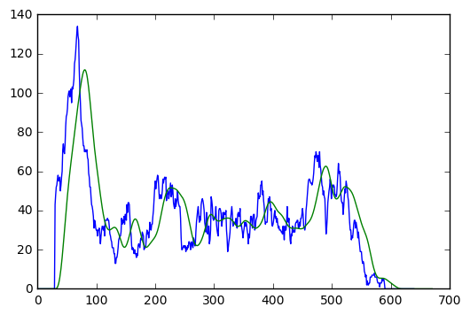

The two major peaks of the histogram represent where the lane lines are most likely located. In order to more accurately find the lanes, a 32x32 hanning filter is used to to smooth the histogram as shown in the green line.

The histogram is applied to a lower `window` of the image to find the bottom x coordinate of the lane line. A certain band of pixels around this x coordinate are saved as pixels belonging to the lane line. 

This window is then moved upwards to find a new x coordinate, with more pixels being saved. The window continues in this manner until it reach the top of the frame, and all of the pixels that likely belonging to the lane are saved. Finally, a parabola of best fit in the form f(y) = Ay^2 + By + C, is generated using `numpy`. The parabolas coefficients are saved in `Line` class.

The result of the pixel finding algorithm on the left (red) and right (blue) lane can be visualized as follows:

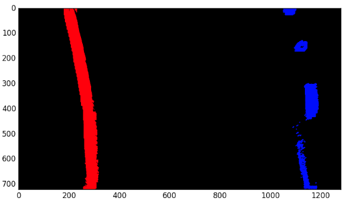


To visualize the fit on the lane, the line of best fit is slotted along with all the pixels associated with the lane.

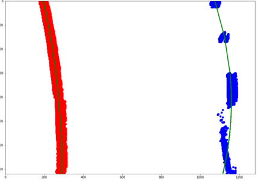


# Drawing the Lane

In order to draw the lane, the `LaneDrawer`class in the tools module is used. The pixels determined in the previous step can be used to draw a filled area using the `cv2.fillPoly(pts)` function. Statistics about where the car is located in the frame are generated by converting from pixel values to real measurements using [US Roadway information](http://onlinemanuals.txdot.gov/txdotmanuals/rdw/horizontal_alignment.htm#BGBHGEGC) to estimate the lane width. The lanes curvature is calculated using the following equation:


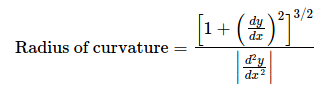

Where the equation y(x) is the parabola of best fit described above. More information on this technique can be found [here](http://www.intmath.com/applications-differentiation/8-radius-curvature.php)

The filled area's color is adjusted according to where the car is located. The filled area will be green if the car is located within a certain threshold of the enter of the lane. It will move from yellow to red as the car gets further and further away from the center. This is accomplished using a linear interpolation on the rgb values of the filled area. If the car is in the center of the lane, it's rgb value should be [0,255,0]. As transitions away from the center, it will first pass yellow ([255,255,0]), then finally hit red ([255,0,0]).

The lane drawing function first draws the filled region on the warped (birds eyes perspective) and thresholded image. It then warps this image back to the original orientation using the `M_inv` matrix. It then combines this with the undistorted image from the first step in the pipeline. Finally, it draws statistics on the combined image.

All of these steps are contained in the `def draw_lanes(self, undist, warped, lines, Minv, include_stats=True)` method in the `LaneDrawer` class.

The final image is as follows:

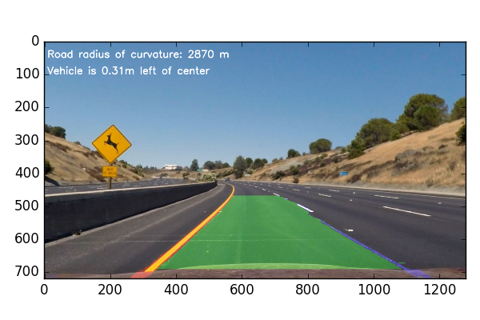


# Conclusion 


All in all this was a challenging project. Thresholding the pixels proved especially difficult as many things can be mistaken for edges and gradients when performing the Sobel operations, and it is not apparent what values to choose when implementing band pass filters for color channels. An easy way to decide what the various thresholds should be is to use a color bar of the image in each given channel space. The following image shows the color bar for the `y` channel of a `yuv` image. It is thus easy to see what the threshold values should be.

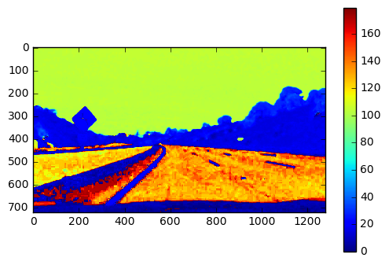

A hypothetical situation that would cause this pipeline to fail would be a gradient edge that is very close to the lane lines. While there is checking with previous frames for if the new detected line matches an old fit, have a gradient edge close to the line for an extended amount of frames would break this checking system. An example of this is shown in the following picture:

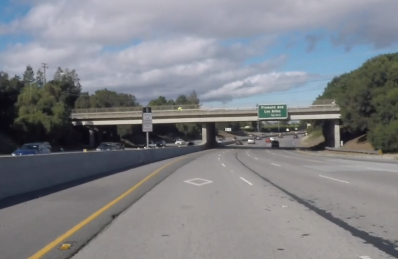


In future work, a checking system that ensures that the lane lines are a certain distance away from each other before marking them as `dectected` would help mitigate this issue.
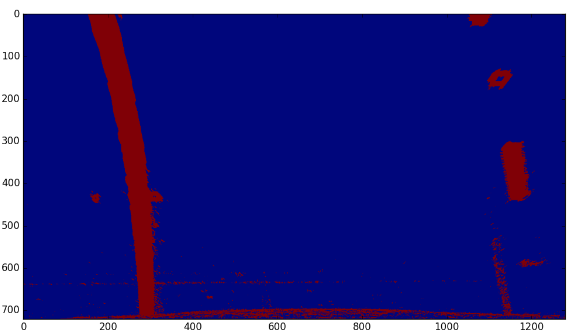

